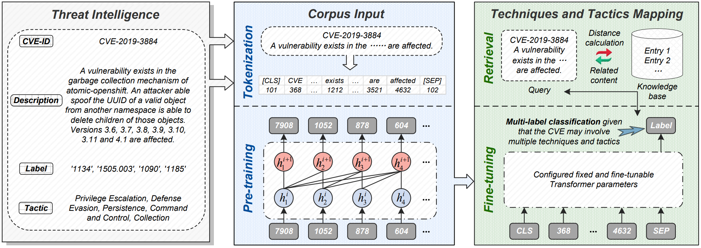
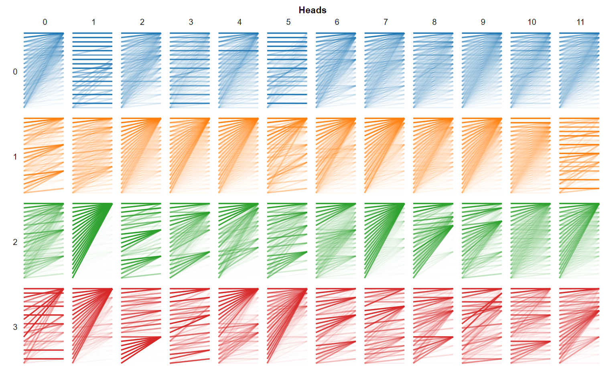
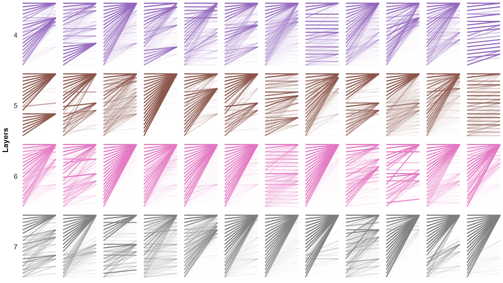
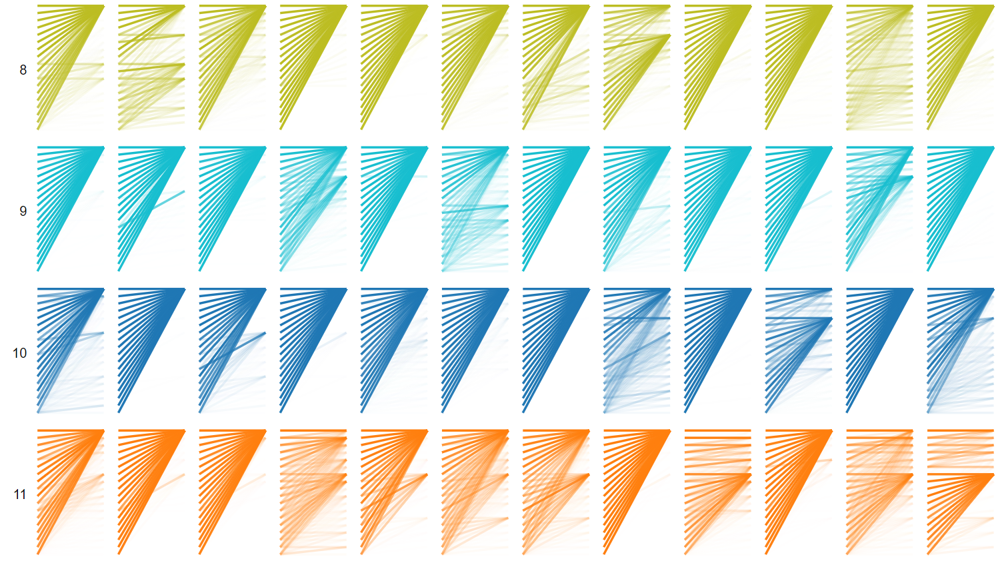

### CyberLLM: Enable Mapping CVE to Tactics and Techniques of Cyber Threats via Large Language Model



## Introduction

CyberLLM leverages the tailor-made large language model for mapping CVEs to cyber threat tactics and techniques. Specifically, we model the mapping of CVE to tactics and techniques as a multi-label classification problem, given that many CVEs correspond to multiple techniques of ATT&CK. Then, the text description is vectorized through the tokenization process, and we deploy a series of data augmentation techniques to enrich the semantic information. Considering that external knowledge bases are helpful to enhance the contextual information of the queried CVE, CyberLLM designs a retrieval strategy based on the Jaccard distance calculation. Finally, we support flexible model fine-tuning to adapt to the needs. 

## Requirements

```bash
pip install numpy
pip install pandas
pip install tqdm
pip install pyecharts
pip install pickle
pip install torch
pip install textattack
pip install transformers
pip install bertviz
```

## Dataset
The ./dataset/ folder stores the used European Union Agency for Cybersecurity (ENISA) report dataset for evaluation. The ENISA dataset collects a total of 27,471 vulnerability information published during 01/01/2018 to 30/09/2019 from various data sources. Based on the Common Attack Pattern Enumeration and Classification (CAPEC) information found in both National Vulnerability Database (NVD) and ATT&CK, this dataset contains 8,077 CVES that are mapped to 50 MITRE ATT\&CK techniques. 

## Model 

The data augmentation module is defined in ./code/augmentation.py.

The model explainer is implemented in ./code/explainer.py.

The main function is stored in ./code/gpt2.py.
```bash
python gpt2.py
```

## Deep Insights

Some additional evaluation results are shown here. 

Attention weights for each head in each layer are visualized. 







### References
- [Linking common vulnerabilities and exposures to the mitre att\&ck framework: A self-distillation approach](https://arxiv.org/abs/2108.01696), Benjamin Ampel, Sagar Samtani, Steven Ullman, Hsinchun Chen - arXiv 2021
- [CVE2ATT&CK: Bert-based mapping of cves to mitre att\&ck techniques](https://www.mdpi.com/1999-4893/15/9/314), Octavian Grigorescu, Andreea Nica, Mihai Dascalu, Razvan Rughinis - Algorithms 2022
- [Linking cve’s to mitre att&ck techniques](https://dl.acm.org/doi/abs/10.1145/3465481.3465758), Aditya Kuppa, Lamine Aouad, Nhien-An Le-Khac - ARES 2023
- [Automatic mapping of vulnerability information to adversary techniques](https://personales.upv.es/thinkmind/dl/conferences/securware/securware_2020/securware_2020_2_70_30027.pdf), Otgonpurev Mendsaikhan, Hirokazu Hasegawa, Yukiko Yamaguchi, Hajime Shimada - SECURWARE 2020

